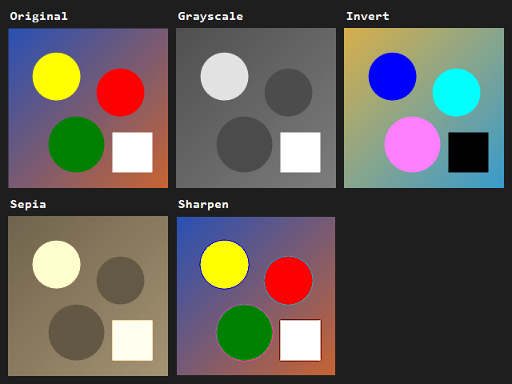

# Image Processor

Aplica filtre pe imagini `.ppm` in C++17. Fara librarii externe.

## Filtre

| Filtru | Operatie |
|---|---|
| Grayscale | `0.299*R + 0.587*G + 0.114*B` |
| Invert | `255 - valoare` per canal |
| Sepia | matrice de transformare |
| Sharpen | convolutie 3x3 |
| Brightness | offset per pixel cu clamping |

Filtrele pot fi inlantuite.

## Design OOP

- `ImageFilter` clasa abstracta cu `apply()`
- 5 filtre derivate
- `FilterPipeline` aplica polimorfic mai multe filtre
- `Image` incapsuleaza buffer-ul de pixeli

## Build & run

```
mkdir build
cd build
cmake ..
cmake --build .
./ImageProcessor
```

Sau direct in CLion.

Programul cere:
1. Calea catre `.ppm` (sau Enter pt o imagine de test)
2. Lista numerelor de filtre (ex: `1 4` pt Grayscale + Sharpen)

Salveaza `output_filtered.ppm`.

## Format PPM

PPM e format text simplu, header + valori RGB. L-am ales pt ca poate fi citit cu STL fara librarii externe.

Pentru poze reale: convertesti `.jpg`/`.png` la PPM cu IrfanView sau GIMP.

## Test files

- `test_input.ppm` - 16x16 cu 4 patrate colorate
- `expected_invert.ppm` - cum trebuie sa arate dupa Invert

## Rezultate



De la stanga: Original, Grayscale, Invert, Sepia, Sharpen.
